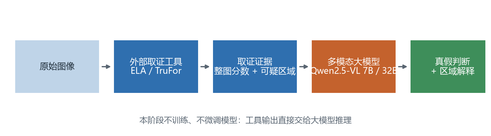
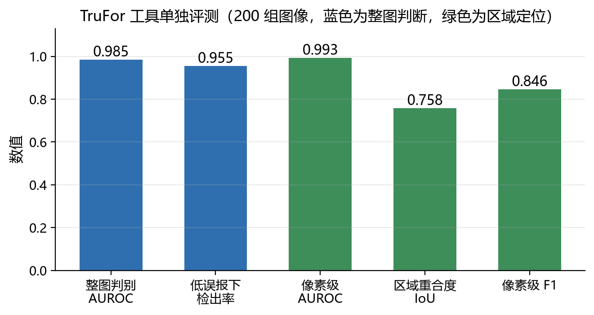
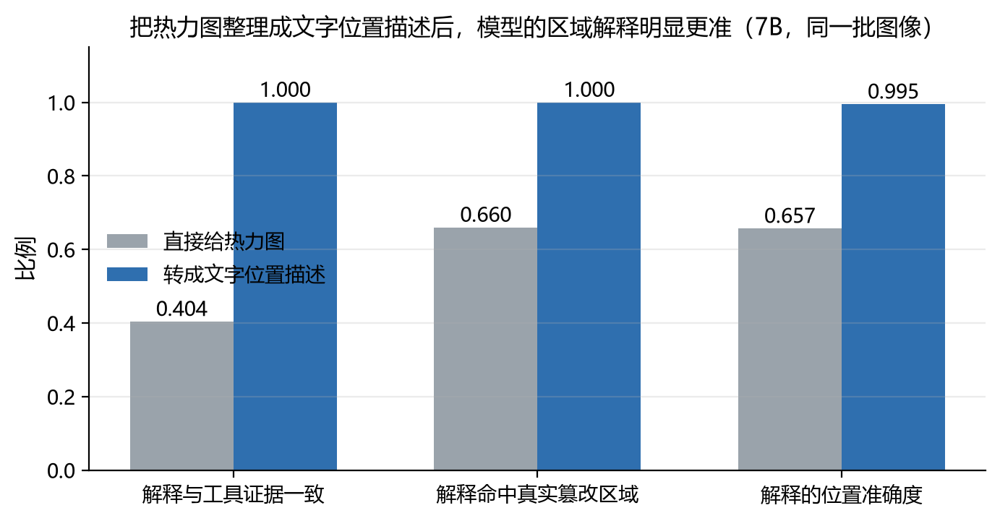
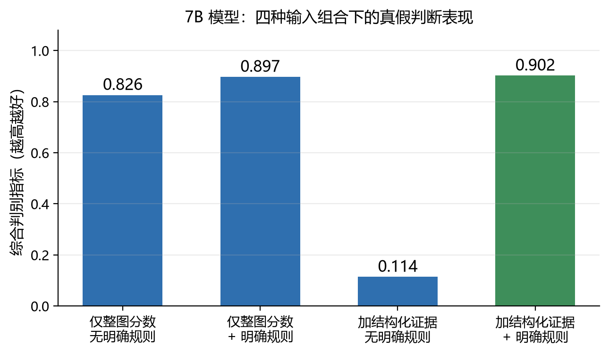
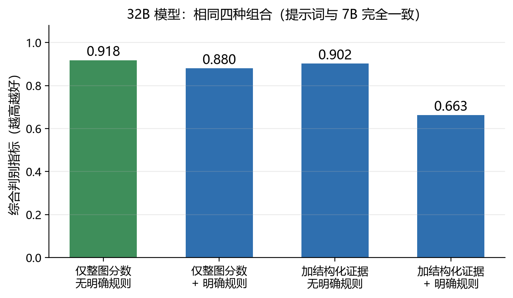
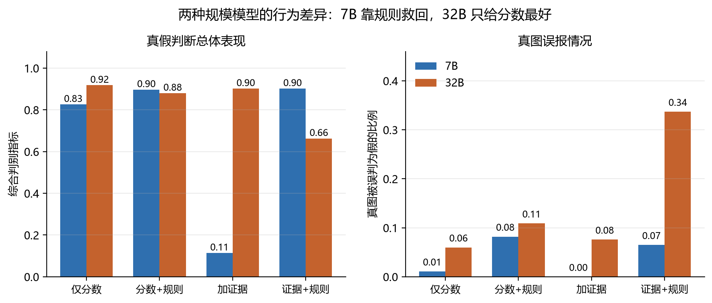
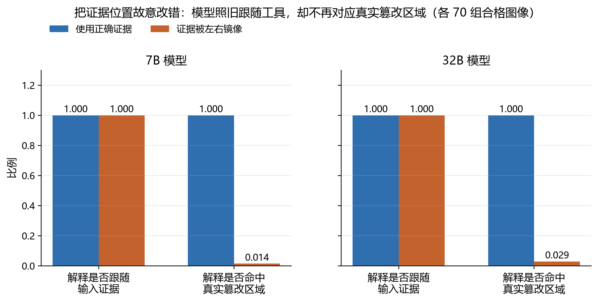
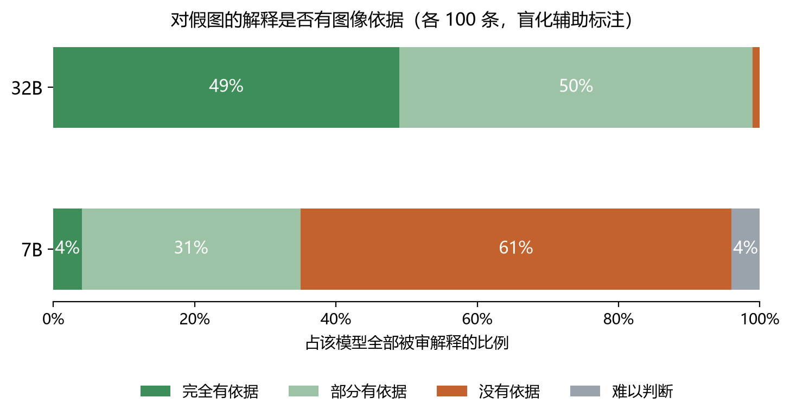
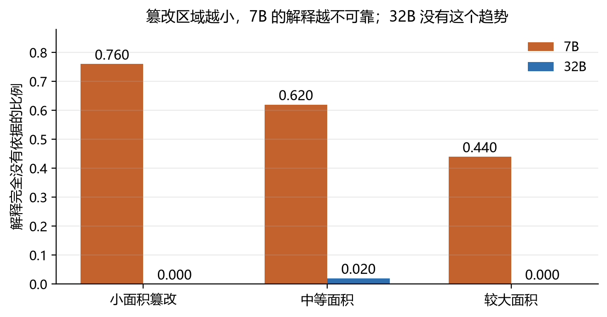

# Training-Free 阶段实验总结：用外部取证工具 + 多模态大模型做图像鉴伪

本文是课题组内部总结，不是论文。目标是让没有参与前期实验的人读完之后，能明白我们为什么做这些实验、一步步发现了什么、哪些最初的猜测被推翻、最后得到什么结论，以及为什么下一阶段需要训练模型。

文中所有数字都来自已冻结的最终分析文件，并通过 `reports/CROSSCHECK.txt` 从逐条原始结果重新核算过（核算结果：0 处不一致）。已标记为无效或被替代的历史结果一律不引用。

---

## 一、我们最初想解决什么问题

传统的图像取证模型（比如本文用到的 TruFor）已经可以做到三件事：判断整张图是真还是假、给出一个篡改概率、标出图中可疑的像素区域。这些能力本身不弱。

但它们有一个共同的短板：**它只告诉你"这里可疑"，不会告诉你"为什么可疑"**。输出是一个分数和一张热力图，普通使用者拿到之后很难判断该不该相信。

多模态大模型的潜在优势正好在这里。它能看图、能用自然语言描述内容，理论上可以把取证工具的结论翻译成人能看懂的说明，比如"右下角那把椅子的边缘有明显的拼接痕迹"。

所以本阶段要回答的问题，不是"怎么训练一个更准的鉴伪模型"，而是更前置的一个问题：

> **如果我们把传统取证工具的结果直接交给多模态大模型，它能不能正确地利用这些信息？**

这个问题必须先回答。如果答案是"能"，那后续工作就是设计更好的配合方式；如果答案是"不能"，那就需要知道具体卡在哪一步，才能决定要不要训练、训练什么。

**本阶段全部是 training-free 的**，也就是完全不训练、不微调模型，只做"工具输出 + 大模型推理"。这不只是资源考虑：一旦开始微调，就分不清模型的表现是"它本来就会用证据"还是"我们教会了它用证据"。先把不训练的上限测出来，后面的训练才有参照。

---

## 二、整体实验路线

基本流程始终是这一条：

```
原始图像 → 外部取证工具 → 取证证据 → 多模态大模型 → 真假判断 + 区域解释
```

而实验本身走过的路线是：

```
ELA（传统方法）
  ↓ 效果不够，换工具
TruFor（训练过的取证模型）
  ↓ 先单独验证工具本身
整图分数 + 热力图
  ↓ 发现模型不看热力图的位置
结构化空间证据（把热力图转成文字描述）
  ↓ 解释变好了，但判断反而变差
提示方式与任务规则实验
  ↓ 找到真正的原因
7B 与 32B 对照
  ↓ 两种规模行为不同
解释正确性专项检查
```

值得说明的是，这条路线上几乎**每一次转向都是被一个否定结果推动的**，而不是按计划推进。下面按顺序讲。



*图 1：本阶段的基本流程。取证工具与大模型都不训练，只研究两者如何配合。*

---

## 三、ELA 阶段：能定位，但不适合当最终判据

### 为什么先用 ELA

ELA 的原理可以一句话说清：**把图像重新压缩一次，再观察不同区域对压缩的反应差异**。原始区域和被编辑过的区域，压缩历史不同，对再次压缩的反应也会不同，因此差异明显的地方可能就是被改过的位置。

选它作为起点有三个理由：不需要训练、不需要权重、完全确定性可复现。如果连 ELA 这样的经典线索大模型都用不起来，那整个设想就要重新考虑。

### 数据集的第一次更换

最初在 CocoGlide 上做，效果不理想——它的篡改方式不能给出我们需要的"干净的局部替换"结构。

后来换到 **TGIF 的 sd2-sp 子集**，这是一个关键决定。sd2-sp 是"用 Stable Diffusion 2 做局部重绘，然后把结果贴回原图"，所以**掩码之外的像素完全没变**（实测掩码外平均绝对差异的中位数是 0.0030，基本就是逐像素一致）。这个性质很重要：

- 标注的掩码确实就是唯一被改动的区域，所以"模型说的位置对不对"这个问题才有意义；
- 一张假图和它配对的真图只在掩码内部有区别，这就天然提供了一个对照；
- 如果用整图重绘的版本，每个像素都变了，"指出被篡改的位置"就无从谈起。

### ELA 阶段的结论

做了校准、定位、两阶段验证、提示方式与热力图的交叉实验，以及一次专门的验证环节尝试。结果可以概括为：

- 模型**确实会看**我们给的 ELA 线索——这一点否掉了"模型根本没读证据"的猜测；
- 但**看对了位置，判断仍然错**。模型能指出正确区域，最终真假结论却不跟着改善；
- 试图加一个"验证步骤"让模型自查，失败了，验证环节自己的输出坍缩成了几乎固定的回答；
- 换成 32B 也没解决，32B 反而坍缩到相反的固定答案——所以问题不是模型太小。

核心结论：

> **ELA 可以作为一个弱的空间提示，但不足以作为可靠的整图真假判据。**

既然工具端太弱，就先换一个更强的工具，把"工具不行"和"模型不会用"这两件事分开。

---

## 四、TruFor：先确认工具本身足够强

TruFor 是一个经过训练的图像取证模型，能同时给出**整图篡改分数**和**像素级可疑区域**。

我们没有直接把它接到大模型上，而是先单独评测它。理由很简单：如果工具本身就不准，后面所有"模型没用好证据"的结论都站不住。

评测用了 200 组图像（每组一张假图 + 一张配对真图）：

| 指标 | 数值 | 含义 |
|---|---|---|
| 整图判别 AUROC | **0.9845** | 区分真假图的总体能力，接近上限 |
| 低误报下的检出率 | **0.955** | 误报率控制在 5% 以内时，能查出 95.5% 的假图 |
| 像素级 AUROC | 0.993 | 逐像素判断是否被篡改的能力 |
| 区域重合度 IoU | 0.758 | 标出的区域与真实篡改区域的重叠程度 |
| 像素级 F1 | 0.846 | 区域定位的综合精度 |



*图 2：TruFor 单独评测结果。蓝色是整图判断能力，绿色是区域定位能力。*

结论很清楚：

> **在当前 TGIF sd2-sp 数据上，TruFor 本身已经是一个很强的取证工具。** 因此后续可以专心研究"大模型如何使用这些证据"，而不必再怀疑工具太差。

需要说明一句：TGIF 的训练划分在这里只是被当作一个未被动过的评测池使用，我们没有训练或调整任何模型。

---

## 五、把 TruFor 的证据交给 7B 模型

我们设计了三类输入来对比：

1. **不给工具结果**：模型只看图，自己判断；
2. **给整图分数**：告诉模型"这张图被工具判为篡改的分数是 0.98"；
3. **给空间热力图**：把标出可疑区域的热力图作为第二张图一起输入。

最初想验证的是：模型会不会同时利用整图分数和空间位置信息。

### 5.1 整图分数非常有用

给出 TruFor 的整图分数之后，真假判断明显变好。在只给分数的条件下，模型的判别表现从"基本不可用"提升到接近工具本身的水平。

**整图分数是一个很强的信号**，这一点在后面所有实验里都反复得到确认。

### 5.2 热力图没有带来预期的提升

这是第一个意外。加入热力图之后，判断**没有变好，反而变差了**。在已经有分数的情况下再给热力图，综合判别指标下降了 0.228。具体病例层面：有 56 张图从"只给分数时判对为假"变成了"加了热力图后判成真"，而反方向的转变是 0 例。

更值得注意的是模型的行为模式：sd2-sp 的篡改区域本来就小（面积中位数不到 4%），所以热力图上高亮的面积也小，看上去并不显眼。模型看到一张"几乎全黑"的热力图，就据此推翻了 0.99 的高分。

### 5.3 平移热力图实验：模型其实没在看位置

为了确认模型到底有没有利用热力图里的**位置**信息，我们做了一个很干净的对照：**把热力图整体平移**，让它和真实篡改区域错位，但热力图里的数值分布一点没变（平移用的是循环移位，数值的多重集逐个元素完全相同，只有对齐关系被破坏）。

结果：

> **热力图位置错了，模型的最终真假判断几乎没有变化**（变化 −0.027，置信区间包含 0，也就是统计上看不出差别）。

对比一下同一批实验里的其他条件：给一张全空白的热力图，判断反而更差（比给正确热力图差）；这说明模型不是在"检查热力图对不对"，而更像是"多了一张看起来没什么内容的图，于是倾向于说这张图是真的"。

这个实验否掉了我们之前的一个解释（认为模型是看到局部响应太弱才否决高分），也给出了一个更基本的结论：

> **模型确实"看到了第二张图"，但并没有真正利用其中的空间对应关系。**

---

## 六、7B 与 32B 的第一次对照

一个很自然的疑问：上面的问题是不是因为 7B 太小？

于是在 32B 上重复了同一组实验，提示词、参数、样本全部不变。结果分两面：

- 32B **对额外图像输入的干扰更小**，不像 7B 那样被热力图带偏那么多；
- 但 32B 在"热力图位置是否和原图对应"这件事上**同样没有检查能力**——平移热力图的影响依旧是 −0.027，置信区间照样包含 0。

所以：

> **单纯增加参数规模，并不能自动解决"模型是否核对空间证据"的问题。**

---

## 七、把热力图改成结构化空间证据

既然模型不擅长自己读热力图，那就换个思路：**先用程序把工具结果整理成明确的文字描述，再交给模型**。比如不给图，而是给：

```
区域 1
  位置：右下
  面积占比：3.2%
  平均可疑度：0.87
  最高可疑度：0.99
```

这里必须强调一点：**这个整理过程完全由固定程序完成，没有再引入任何模型**。具体规则是固定的：可疑度阈值取 0.5，用四连通方式找连通区域，过滤掉面积占比小于 0.001 的碎块，按可疑度总量排序取前 3 个，位置用 3×3 网格命名（左上、上中、右下……），坐标做归一化。整套参数在实验前就冻结了。

### 7.1 空间解释明显改善

改成结构化证据之后，模型在位置上的表现有了质的变化：

- 模型引用的位置**几乎总是和输入证据一致**（一致率 1.000）；
- **从不编造证据里不存在的区域**（虚报率 0.000）；
- 相比之下，直接给热力图时，模型的解释只有 0.404 与证据一致。

和真实篡改区域比，改善同样明显：



*图 6：把热力图整理成文字位置描述后，模型的区域解释明显更准（7B，同一批图像配对比较）。*

在同一批图像上配对比较，"解释命中真实篡改区域"从 0.660 提升到 1.000，位置准确度从 0.657 提升到 0.995。两项提升的置信区间都不含 0。

这说明结构化不只是让模型更会"复述"证据，也确实让解释更接近真实情况。

### 7.2 但真假判断不一定更好

这是本阶段最重要的转折点。

结构化证据让空间解释变好了，但**真假判断反而严重下降**：只给分数时综合判别指标是 0.826，加上结构化证据之后掉到 0.114。

信息更清楚了，判断却更差了。这个反直觉的现象，我们花了三轮实验才弄清原因。

---

## 八、三轮排查：真正的原因是提示方式

### 第一个猜测：是"面积"这个字段的问题？

从模型给出的理由文本里，我们注意到大量"篡改范围有限""区域很小"这类说法，于是猜测是 `面积占比` 这个字段让模型觉得"改动太小，可以忽略"。

于是做了字段拆解实验，把结构化证据拆成只给位置、只给面积、只给可疑度、给位置+面积、给全部，六种条件各跑一遍。

**这个猜测被否证了**：

| 给什么 | 判别指标 |
|---|---|
| 只给整图分数 | 0.826 |
| 只给位置 | 0.141 |
| 只给面积 | 0.196 |
| 只给可疑度 | 0.103 |
| 位置 + 面积 | 0.212 |
| 全部字段 | 0.114 |

每一个单独字段造成的伤害都差不多大，面积甚至不是最严重的。更关键的是：**在"只给位置"的基础上再加上面积，表现反而变好了**（提升 0.071，统计显著）。如果面积是罪魁祸首，不应该出现这个结果。

### 第二个猜测：是字段太多、JSON 太复杂？

于是改判为"结构化信息本身造成了干扰"。这个猜测也**基本被否证了**。

我们设计了一组更细的对照：同一套提示词，但载荷从"什么都不给"、"给一个空的区域列表"、"给一个没有任何取证含义的占位区域"、"给真实位置"、"给数量相当但无取证意义的编号字段"逐级变化。

结果非常清楚：**用结构化的提示词但载荷完全为空时，判断就已经崩了**。模型手里没有任何位置、面积、可疑度数据，却照样大量生成"局部修改""范围有限"这类说法。

所以真正起作用的不是数据内容，而是**我们如何向模型描述这件事**。当提示中强调"这些是局部区域的取证信息"，7B 就很容易产生这样的判断：

> "虽然局部存在修改，但整张图仍然可以算是真实的。"

有一个诊断指标把这件事钉死了：**"承认有篡改但仍判为真"这种自相矛盾的情况，在只给分数时是 0.000，在所有结构化条件下都升到 0.25～0.60**。也就是说，问题出在最终判断这一步，不是出在看图这一步。

### 第三个猜测：需要把"是否存在"和"范围多大"拆开判断？

我们试了：让模型先输出"是否存在篡改"，再输出"范围是局部还是大面积"，最后给结论。

**这个方向也被否证了**：拆开之后，模型判断"是否存在篡改"的误报率高达约 0.95，变成了过度检出，整体并没有改善。结构上的拆解不是答案。

---

## 九、明确二元真假规则：一句话的效果

既然问题是模型误解了任务——把"局部小改动"理解成"整张图基本还是真的"——那就直接把任务定义说清楚。我们在提示里加了一句话：

> 本任务的真假标签是二元的。只要有可信证据表明图像的任何部分确实被篡改过，无论该区域多小、多局部，都应判为假。

效果立竿见影：召回率从 0.114 升到 0.967，综合判别指标从 0.114 升到 0.902。

但到这里**还不能下结论**。因为这一句规则是加在"有结构化证据"的条件上的，我们无法区分两种可能：是这句规则专门修复了结构化证据带来的偏差？还是它对任何条件都有效，只是我们之前没试过？

---

## 十、严格对照：不是结构化证据让它更准

为了把这件事分清，我们补了一个完整的四格对照。缺的那一格是"只给分数 + 加规则"。

|  | 不给结构化证据 | 给结构化证据 |
|---|---|---|
| **不加明确规则** | A0 | A2 |
| **加明确规则** | A1 | A3 |

结果：

| 条件 | 召回率 | 真图误报率 | 综合判别指标 |
|---|---|---|---|
| A0 仅分数、无规则 | 0.837 | 0.011 | **0.826** |
| A1 仅分数、加规则 | 0.978 | 0.082 | **0.897** |
| A2 加证据、无规则 | 0.114 | 0.000 | **0.114** |
| A3 加证据、加规则 | 0.967 | 0.065 | **0.902** |



*图 3：7B 模型在四种输入组合下的真假判断表现。*

关键在于：**A1 是 0.897，A3 是 0.902，两者几乎没有区别。** 更严格地说，A3 减 A1 的三项差异（召回率 −0.011、误报率 −0.016、综合指标 +0.005）置信区间全部包含 0。

所以结论必须这样写：

> **7B 的提升主要来自"把任务规则讲清楚"，而不是结构化空间证据提高了真假判断能力。** 在任务规则已经明确的前提下，加不加结构化证据，判别表现没有差别。

这一点很容易讲错，值得多说一句。我们自己在中途就写错过一次：当时拿"加证据+加规则"的 0.902 去和"仅分数、无规则"的 0.826 比，得出"结构化证据带来了净提升"。这个对比是错的——正确的对照组是"仅分数+加规则"的 0.897。那个所谓的提升来自规则，不来自证据。

另外要诚实指出一个技术性限制：A0 的召回率已经是 0.837，上升空间本来就只剩 0.163，所以"A1 − A0 看起来不大"不能直接读成"规则在只给分数时没用"。事实上规则在两种条件下都改变了模型的判断倾向——两边的误报率都上升了（+0.071 和 +0.065）。

---

## 十一、32B 的行为完全不同

最后把同样的四种条件在 32B 上跑了一遍。提示词与 7B **逐字节相同**（做了哈希校验），样本完全一致，所以唯一的变量就是模型规模。

| 条件 | 召回率 | 真图误报率 | 综合判别指标 |
|---|---|---|---|
| B0 仅分数、无规则 | 0.978 | 0.060 | **0.918** |
| B1 仅分数、加规则 | 0.989 | 0.109 | **0.880** |
| B2 加证据、无规则 | 0.978 | 0.076 | **0.902** |
| B3 加证据、加规则 | 1.000 | 0.337 | **0.663** |



*图 4：32B 模型在相同四种组合下的表现。最好的配置是最简单的那一个。*



*图 5：两种规模模型的行为差异。左图是总体判别表现，右图是真图被误判为假的比例。*

差异非常明显：

**7B 的特点**
- 对提示方式很敏感，加结构化证据后判断一度崩到 0.114；
- 加一句明确规则可以救回来（0.114 → 0.902）。

**32B 的特点**
- 本身就能很好地使用整图分数，不加任何东西就有 0.918；
- **加结构化证据不会崩**（0.978 vs 0.978，召回率差异精确为 0.000）；
- **加规则反而有害**：真图误报率从 0.060 升到 0.109，加在结构化证据上时更是升到 0.337，也就是三分之一的真图被误判为假。

最终一个需要讲清楚的结果：

> **32B 上最好的配置，反而是"只给整图篡改分数"这个最简单的做法**（0.918），它比 32B 的任何加证据配置都好，也比 7B 的任何配置都好。

这对我们前几轮的结论是一个重要修正。7B 上总结出的两条机制——"结构化证据会严重伤害判断"和"明确规则能修复判断"——**在 32B 上都不成立**。用配对统计比较两个规模的效应差异，12 项里有 11 项的置信区间不含 0，也就是说规模几乎改变了每一个效应。

所以这些机制**与模型规模有关，不能说成是这一类模型的普遍规律**。原本希望把结论提升为"在 7B 和 32B 上都稳定成立"，这个提升没有发生。

唯一在两种规模上都成立的结论是分工：

> **整图分数负责真假判断，结构化空间证据负责可核查的区域解释。**

---

## 十二、空间解释到底准不准

这一部分不再跑新推理，全部基于已有结果重新分析。我们建立了三个对象并两两比较：

```
真实篡改区域（标注掩码）
      ↕
TruFor 给出的结构化证据
      ↕
大模型在解释里说的区域
```

### 12.1 工具与真实区域的关系

| 指标 | 数值 | 含义 |
|---|---|---|
| 位置准确度 | **0.979** | 工具指出来的格子，绝大多数确实是篡改区域 |
| 覆盖完整度 | **0.531** | 但只覆盖了真实篡改范围的大约一半 |

> **TruFor 指出来的地方大多数确实有问题，但它通常只覆盖真实篡改范围的一部分。**

### 12.2 模型与工具的关系

在结构化证据条件下，模型解释与输入证据的一致率是 **1.000**，虚报率 **0.000**。模型几乎完全忠实地复述了工具的结论。

### 12.3 模型与真实区域的关系

因为模型忠实复述工具，所以它**同时继承了工具的优点和缺点**：位置很准（0.995），但覆盖同样不完整（约 0.52，基本等于工具的 0.531）。

这里要提醒一个读数陷阱：**"命中真实篡改区域"这个指标看起来是 1.000，但不应该被当作"解释很好"的证据**。它高是三件事共同造成的——工具本身位置准、模型忠实复述、以及标注掩码常常横跨多个网格（184 张里有 54 张跨 4 格以上，格子多了自然容易命中）。真正有信息量的是那个 0.52 的覆盖度，和下面镜像实验的结果。

---

## 十三、镜像实验：模型很听话，但不会自己纠错

这是本阶段最直观的一个实验。

我们把结构化证据**左右镜像**，让位置描述变错，但面积、可疑度这些强度数值保持不变，原图也完全不动。然后看模型怎么反应。

用一个具体例子说明：

**给正确证据时**

| | 位置 |
|---|---|
| 工具说 | 右下 |
| 模型解释说 | 右下 |
| 真实篡改区域 | 右下 |

**把证据镜像之后**

| | 位置 |
|---|---|
| 工具说（已被改错） | 左下 |
| 模型解释说 | **左下** |
| 真实篡改区域 | 右下 |

统计结果（各 70 组合格图像，这个子集在看到任何镜像结果之前就已冻结）：



*图 7：把证据位置故意改错之后，模型照旧跟随工具，却不再对应真实篡改区域。*

| | 解释是否跟随输入证据 | 解释是否命中真实区域 |
|---|---|---|
| 7B 正确证据 | 1.000 | 1.000 |
| 7B 镜像证据 | **1.000** | **0.014** |
| 32B 正确证据 | 1.000 | 1.000 |
| 32B 镜像证据 | **1.000** | **0.029** |

配对比较：对证据的跟随程度变化**精确为 0.000**，而与真实区域的一致性下降了 0.986（7B）和 0.971（32B）。

通俗地说：

> **模型很听工具的话，但它不会自己检查工具是不是错了。工具错在哪里，模型通常也跟着错到哪里。**

这个结论在两种规模上都成立，是本阶段最稳定的发现之一。它也说明：结构化证据带来的"解释准确"，是**借来的**准确——来源于工具正确，而不是模型自己有核对能力。

---

## 十四、位置说对，不代表理由说对

前面所有分析都只看"位置"。但一个解释除了位置，还包括"为什么这里可疑"。这部分需要检查自然语言内容本身。

### 14.1 检查方法与它的限制

我们抽取了 100 张假图 + 50 张真图，对每张图取 7B 和 32B 各一条解释，共 300 条，用盲化的辅助标注逐条检查每个说法有没有图像依据。另外抽 30 组重做一遍，用来衡量标注本身的稳定性。

**必须明确写下这个方法的限制**，否则后面的数字会被高估：

1. **标注者不是独立的第三方**。当前环境里没有可用的独立标注接口，实际是由盲化的同模型家族代理完成的。它们看不到对话历史、看不到模型身份、看不到判断结果和工具分数，但它们**不是独立标注，不能当作人工真值**；
2. **最关键字段的重复一致性只有 0.650**（"篡改说法是否有依据"这一项），而它恰好承载了下面 7B 与 32B 的主要对比。方向性结论还站得住，因为差距远大于噪声，但具体数值不应过度解读；
3. **"是否虚构物体"这一项的一致性系数退化为 −0.017**（虽然一致率 0.967），原因是正例太少，这个系数在这里没有意义，对应的数字只能当作低可靠度参考；
4. **纹理、光照、边缘、几何、物理关系这五类说法的可评估样本各只有 0～3 条**，对应结论完全不能引用。这个稀缺本身是个发现，见 14.4。

### 14.2 7B：位置常对，理由常错

对假图的 100 条解释：

| 评定 | 比例 |
|---|---|
| 完全有图像依据 | 4% |
| 部分有依据 | 31% |
| **没有依据** | **61%** |
| 难以判断 | 4% |

其中"这个区域被篡改了"这类说法，**没有依据的比例约 79.1%**。

对照一下空间结果：7B 在这 100 张图上**位置全部说对**（100/100 命中）。所以问题不在看图，在推理。

具体的错误模式有两种，都在标注里被抓到了：一是承认该区域被改过、然后仍然得出"这张图是真的"；二是把 0.99 的篡改分数读成"说明这里是真实内容"（在真图解释里，出现内部自相矛盾说法的有 14/50 条，而 32B 是 0/50）。

这正是前面第八节那个"承认有篡改但仍判为真"现象，在自然语言层面的确认。

### 14.3 32B：同样输入下解释稳定得多

| 评定 | 比例 |
|---|---|
| 完全有图像依据 | **49%** |
| 部分有依据 | 50% |
| **没有依据** | **1%** |
| 难以判断 | 0% |

"这个区域被篡改了"这类说法没有依据的比例是 **4.4%**（7B 是 79.1%）。



*图 8：对假图的解释是否有图像依据（7B 与 32B 各 100 条，同一批图像、逐字节相同的提示词）。*

在完全相同的 100 张图上配对比较：32B 的无依据说法更少的有 81 例，7B 更少的有 3 例，打平 16 例。而且这不是靠多说话换来的——两者每条解释的说法数量差不多（7B 5.4 条，32B 5.1 条）。

### 14.4 问题不是"看见不存在的东西"

一个容易误解的点：两个模型**虚构物体的情况都很少**（假图上 7B 3%、32B 1%，真图上都是 0%）。

所以 7B 的主要问题不是"凭空看见一个不存在的东西"，而是：

> **明明找到了正确位置，却对这个位置代表什么做出了错误解释。**

另外还有一个跨越两个模型的共同短板：在 300 条解释里，涉及**纹理、光照、边缘、几何、物理关系**的可评估说法各只有 0～3 条。两个模型的解释几乎只在讲两件事——"哪里被改了"和"是否被改了"，很少真正分析"凭什么看出来"。

---

## 十五、为什么小面积篡改更难解释

按篡改面积分层看 7B 的解释质量：

| 篡改面积 | 解释完全没有依据的比例 |
|---|---|
| 小面积 | **0.760** |
| 中等面积 | 0.620 |
| 较大面积 | 0.440 |



*图 9：篡改区域越小，7B 的解释越不可靠；32B 没有这个趋势。*

32B 在三个层级上分别是 0.000、0.020、0.000，看不出趋势。

一个合理的解释是：**小区域虽然能被专业取证模型发现，但从普通视觉内容上可能并没有明显异常**。TruFor 依靠的是压缩痕迹、噪声统计这类信号，而这些信号肉眼看不出来。所以 7B 处在一个尴尬位置——它知道工具说哪里可疑，但看那块区域又看不出什么问题，于是只能编一个理由。

---

## 十六、这个阶段最后得到什么

不写宏大总结，直接回答五个实际问题。

### 问题 1：外部取证工具有用吗？

**有用。** TruFor 在当前数据上可以提供可靠的整图分数（AUROC 0.9845）和位置准确的可疑区域（位置准确度 0.979）。工具端不是瓶颈。

### 问题 2：大模型能不能直接利用取证结果提高真假判断？

**能利用整图分数，但空间证据没有稳定带来额外提升。**

整图分数是强信号，两种规模都能用好。而空间证据——无论是热力图还是结构化描述——在任务规则明确的前提下都没有带来额外的判断提升：7B 上差异为 +0.005（置信区间含 0），32B 上是 **−0.217**（置信区间不含 0，也就是确实变差了）。

### 问题 3：大模型能不能理解空间证据？

**结构化之后可以。** 它能非常准确地复述"工具认为哪里有问题"（一致率 1.000，虚报率 0.000）。但直接给热力图不行（一致率只有 0.404）。

### 问题 4：大模型会不会自己检查工具是否正确？

**目前看不会。** 把热力图整体平移，判断几乎不变（−0.027，置信区间含 0）；把结构化证据左右镜像，模型照旧完全跟随错误位置（跟随度变化精确为 0.000，而与真实区域的一致性掉到 0.014／0.029）。两种规模都是这样。

### 问题 5：大模型能不能解释为什么这里是假？

**7B 不稳定，32B 明显更好，但两者都还不够。**

7B 有 61% 的解释没有图像依据，篡改说法的无依据率约 79.1%；32B 对应是 1% 和 4.4%。但即使是 32B，自由生成的解释也主要集中在"哪里被改了""是否被改了"，很少真正分析纹理、光照、边缘、几何、物理关系。

所以：

> **在不训练的条件下，只靠提示词还不足以让模型产生丰富、稳定、细致的伪造原因解释。**

这就是下一阶段需要训练的直接理由。

### 需要一并记住的限制

1. **只在一个数据集、一类篡改上验证过**（TGIF sd2-sp 局部重绘拼接，篡改面积中位数不到 4%）。换数据集、加压缩、换取证工具、换模型家族都没有验证；
2. **所有报告用的阈值都是评测时选定的工作点，不是可以直接部署的阈值**；
3. **语义解释部分的标注不是独立人工真值**，关键字段重复一致性 0.650；
4. **7B 上总结的两条机制与模型规模有关**，不能写成这一类模型的普遍规律。

---

## 十七、下一阶段

本阶段回答的是"工具 + 大模型直接推理能做到什么"。答案是：判断已经够用（靠工具分数），位置解释可以做到可核查（靠结构化证据），但**"为什么这里是假的"这个问题没有解决**。

下一阶段的计划是：

> 通过微调 / 后训练，让模型学会针对篡改区域给出更具体的视觉依据。

可能关注的方向：

- 纹理不连续；
- 边界与拼接痕迹异常；
- 光照与阴影不一致；
- 几何关系不合理；
- 物理关系不成立；
- 局部编辑留下的痕迹。

本阶段有两个现成的条件可以直接用上：一是 sd2-sp 的真假图只在掩码内有差别，天然提供"到底哪里变了"的对照；二是第十四节那套解释审查标准已经建立，可以直接用来衡量训练后的解释是否真的变正确了，而不只是变流畅了。

**这些都属于下一阶段，不属于当前 training-free 实验的结论。**

---

## 附：材料位置

| 内容 | 位置 |
|---|---|
| 实验索引（26 个正式实验） | `docs/EXPERIMENT_INDEX.md` |
| 模型版本、哈希、数据清单 | `docs/FINAL_EXPERIMENT_MANIFEST.md` |
| 哪些旧结果不能再引用 | `docs/INVALID_AND_SUPERSEDED_RUNS.md` |
| 数据集与划分 | `docs/DATASET_AND_SPLITS.md` |
| 复现步骤 | `docs/REPRODUCIBILITY.md` |
| 完整英文实验报告 | `reports/TRAINING_FREE_EXPERIMENT_REPORT.md` |
| 数字核算结果 | `reports/CROSSCHECK.txt` |

本阶段代码与结果已冻结，标签 `training-free-v1`。
